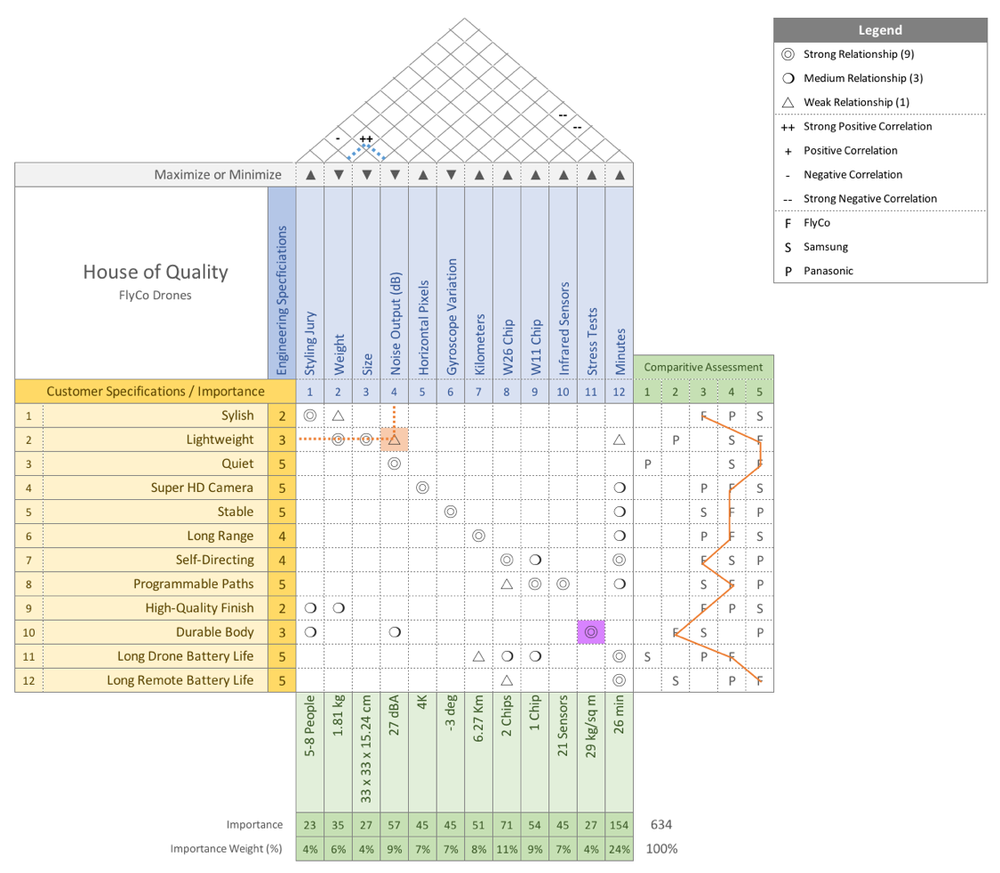

<!-- .slide: data-background="#500000" class="dark" -->

# HoQ for Autonomy

## Introductory Discussion 

November 13, 2019

---

<!-- .slide: data-background="#767171" class="dark" -->

## First things first

- Center of Pressure Seat   

---

<!-- .slide: data-background="#767171" class="dark" -->

## Lit Review
- [Chad Jenkins, Michigan](https://web.eecs.umich.edu/~ocj/)
 - [Semantic Robot Programming](https://www.youtube.com/watch?v=ZJLD_6v88KA&feature=youtu.be)
 - "make the real world programmable"
- [Tim Barfoot, Toronto](http://asrl.utias.utoronto.ca/~tdb/)
 - [Visual Teach and Repeat](https://www.youtube.com/watch?time_continue=3&v=udI328uO7Qg)
 - Single sensor, no feedback
- [Sergey Levine, Berkeley](https://people.eecs.berkeley.edu/~svlevine/)
  - [Shared Autonomy](https://bair.berkeley.edu/blog/2018/04/18/shared-autonomy/)
  - [Learning to Use Tools](https://www.technologyreview.com/s/613304/a-robot-has-figured-out-how-to-use-tools/)

---

<!-- .slide: data-background="#767171" class="dark" -->

## What Does the HoQ Say?
  

---

<!-- .slide: data-background="#767171" class="dark" -->

## My Thoughts on Application
| Probability | State        | Accelerate | Decelerate | Stop  | Constant |
|-------------|--------------|------------|------------|-------|----------|
|  .95        | Red Light    | 0          | 9          | 9     | 0        |
| .03         | Yellow Light | 3          | 3          | 0     | 9        |
|  .02        | Green Light  | 1          | 0          | 0     |  9       |
|             | Importance   | 0.6%       | 48.7%      | 48.2% | 2.53%    |

---

<!-- .slide: data-background="#767171" class="dark" -->

## More Depth

[Brainstorm Scratch Paper](https://docs.google.com/spreadsheets/d/1-miV_nTWT6CTp50ss_0I4ry6K127J0W6t3MZOVOl0Lc/edit?usp=sharing)

---

<!-- .slide: data-background="#767171" class="dark" -->

## Open Questions
- Is a single row-sum operation sufficient?
  - Can we assign math meaning to the roof?
- How to shift in time?
  - Discrete system?
- Algorithm to fill matrix:
  - ANN is obvious
  - Simple stats ok too       
- Literature is **very** sparse
- Dedicating independent matricies

---

<!-- .slide: data-background="#767171" class="dark" -->

## Action Items
Implement in a Jupyter game
:blue_car:

