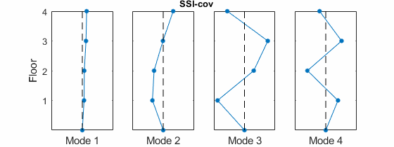
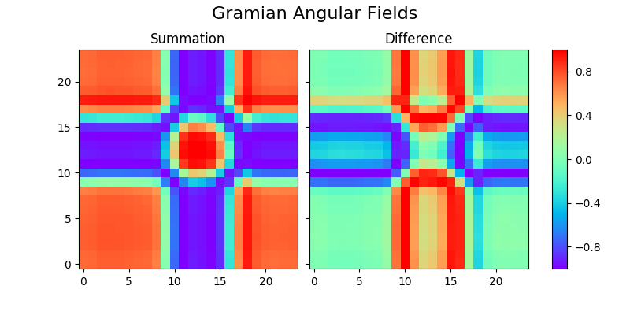
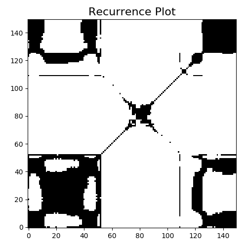
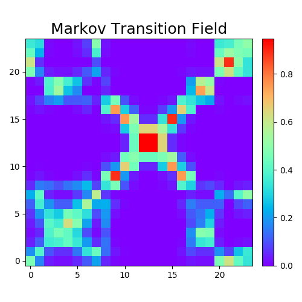
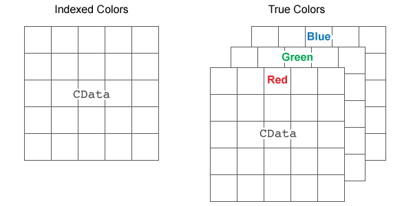

<!-- .slide: data-background="#500000" class="dark" -->

# Bi-Weekly Notes

## OMA and ANNs

2020-03-05

---

<!-- .slide: data-background="#767171" class="dark" -->

## OMA for EEG

  

---

<!-- .slide: data-background="#767171" class="dark" -->

## OMA Questions
- Are the channels connected like spring-mass cart systems?
- Which algorithm is best, more importantly how to verify?

---

<!-- .slide: data-background="#767171" class="dark" -->

## EEG Neural Nets: New Architecture
- There's currently not enough info in the single matrix to learn from
- NN doesn't care if heatmap is BW
- There are multiple ways to visualize TS data

| | | |
|:-------------------------:|:-------------------------:|:-------------------------:|
|  |  ||

---

<!-- .slide: data-background="#767171" class="dark" -->

## EEG Neural Nets: New Architecture
 

---

<!-- .slide: data-background="#767171" class="dark" -->

