<!-- .slide: data-background="#500000" class="dark" -->

# Bi-Weekly Notes

## Complex Eigenvalues

2020-03-19

---

<!-- .slide: data-background="#767171" class="dark" -->

## Plots

<section>
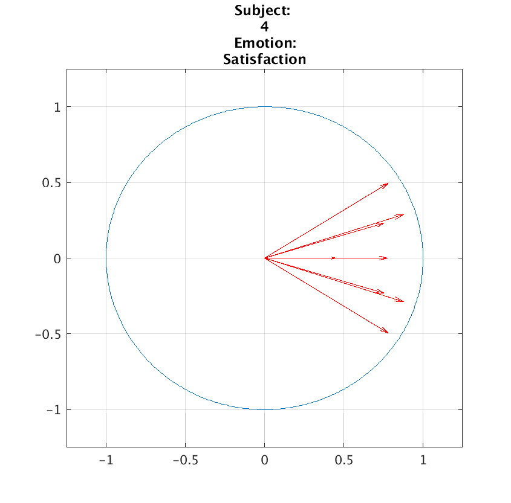 
</section>
<section>
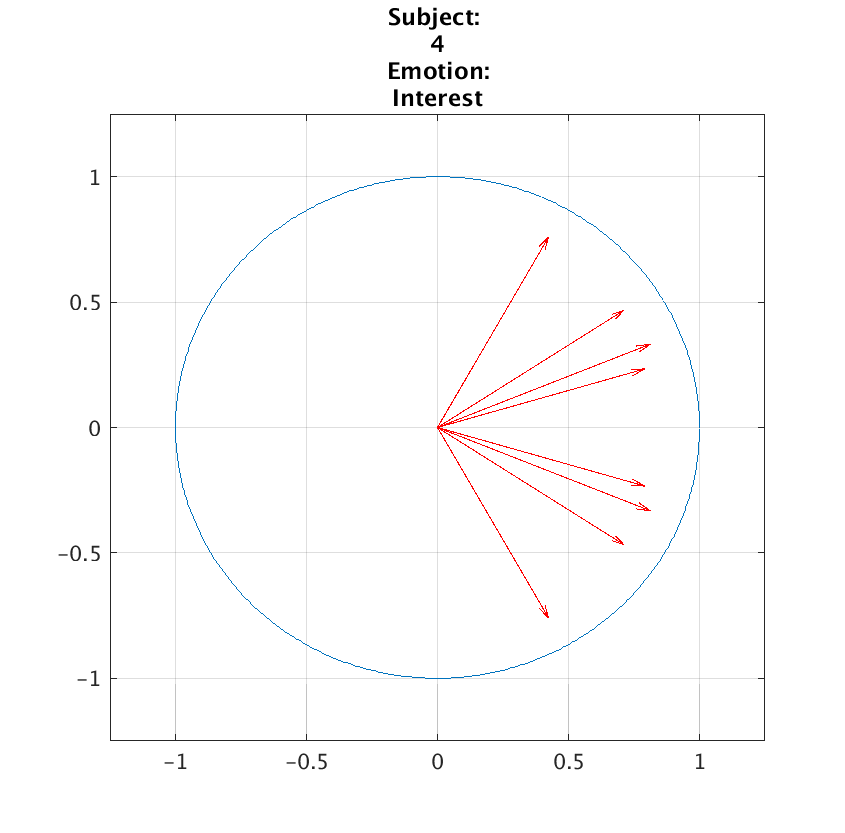 
</section>
<section>
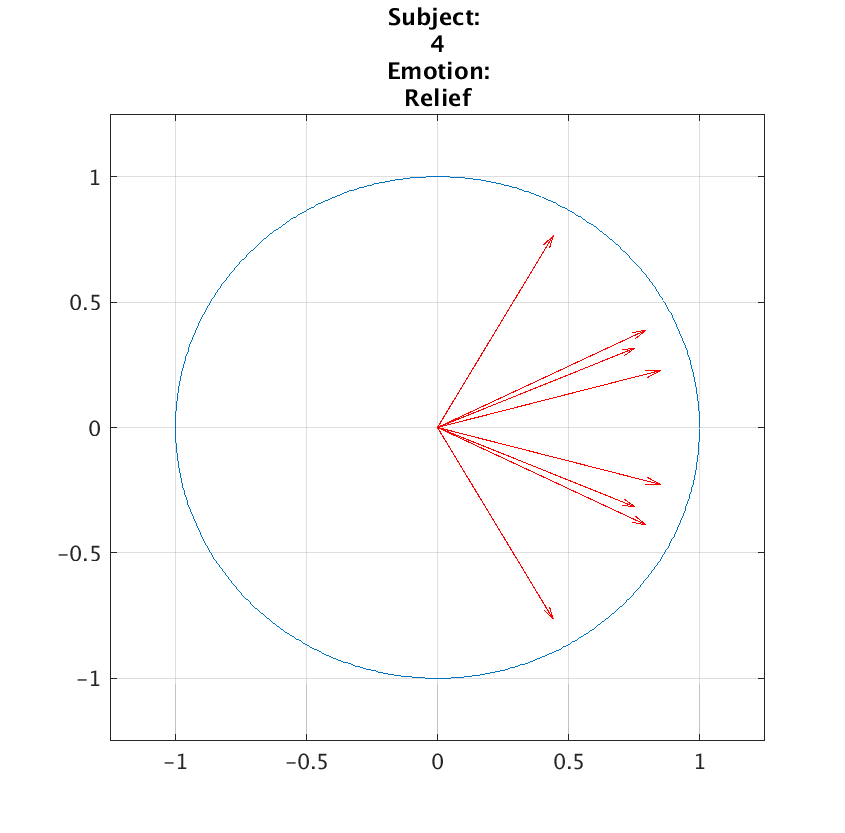 
</section>
<section>
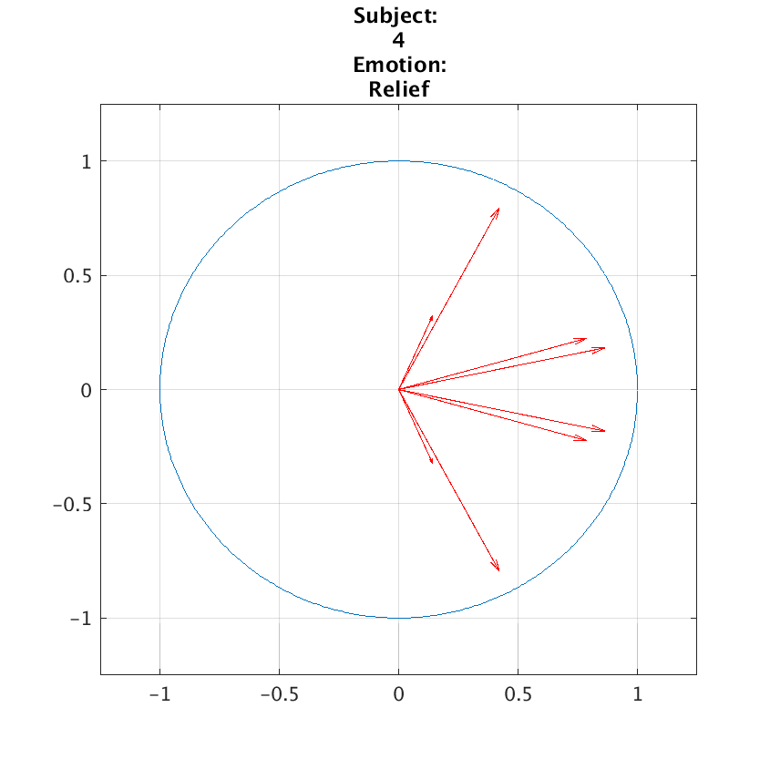 
</section>
<section>
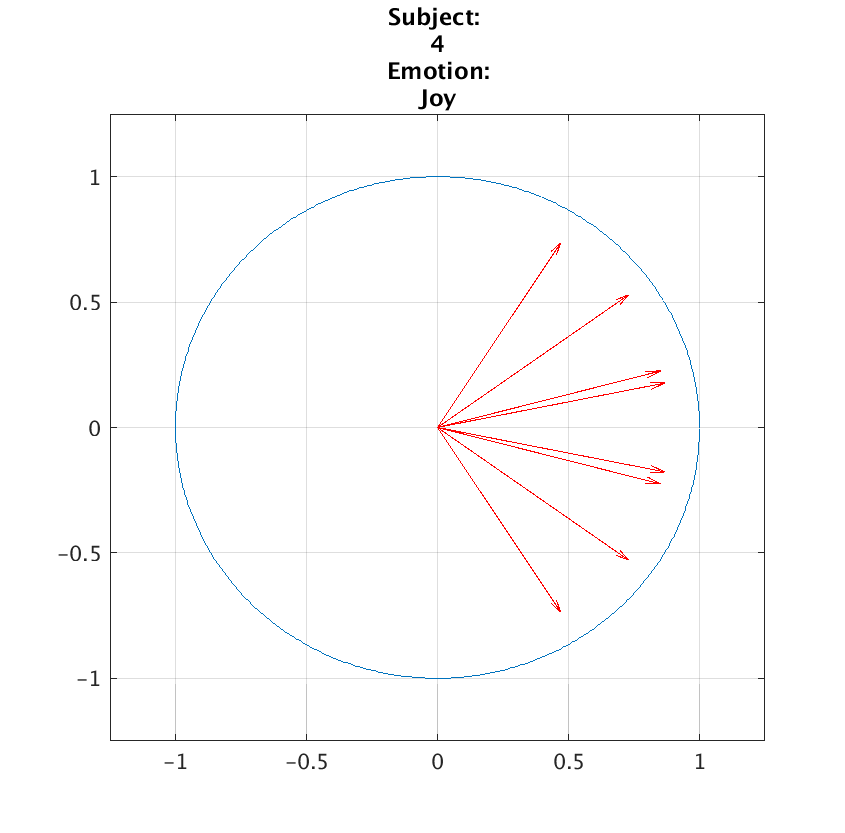 
</section>
<section>
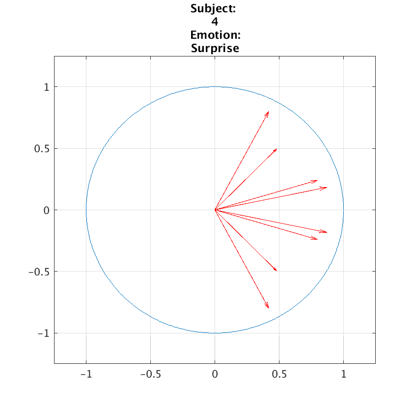 
</section>
<section>
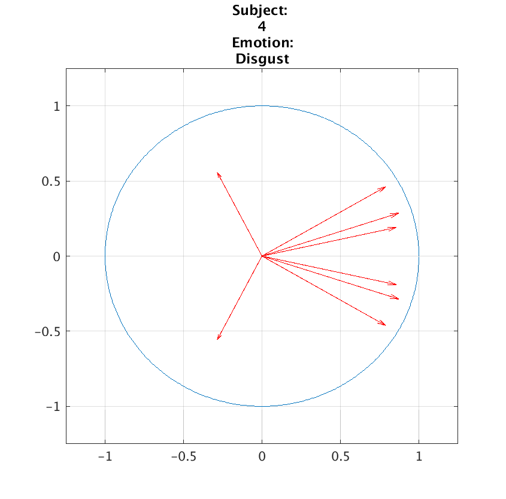 
</section>

---

<!-- .slide: data-background="#767171" class="dark" -->

## Plots 2

<section>
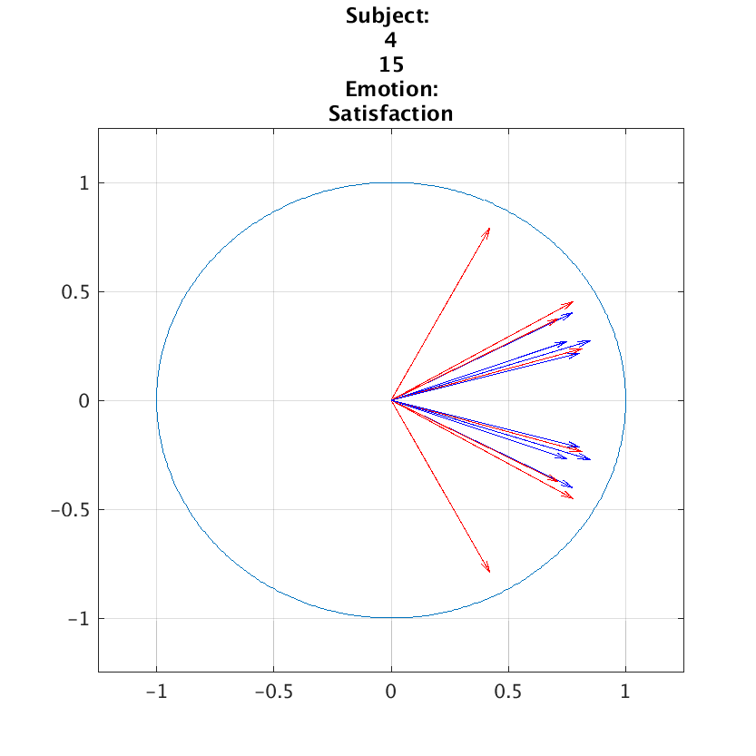 
</section>
<section>
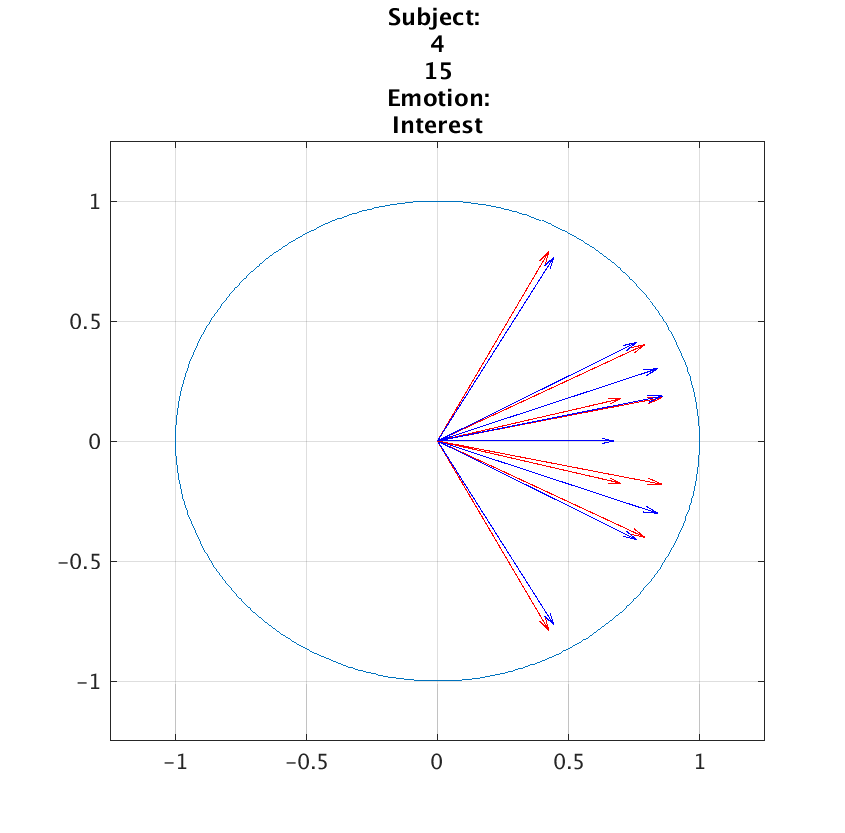 
</section>
<section>
 
</section>
<section>
 
</section>
<section>
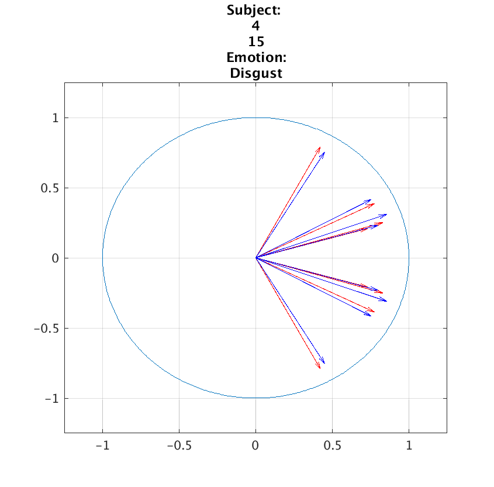 
</section>
<section>
 
</section>
<section>
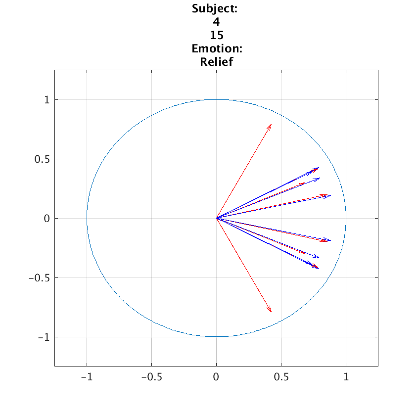 
</section>

---

<!-- .slide: data-background="#767171" class="dark" -->

## Questions from Literature and Data Analysis
- Very few of the A matrices are stable
- Difficult to select proper system order
    - Always a complex pair, so system order is twice the modes
- Doesn't account for non-linearity
- Ok to have a new A for every subject/emotion? 
    - Currently, not an overarching A matrix
    - Difficult to separate modes that are close in freq space.

<!-- | | | |
|:-------------------------:|:-------------------------:|:-------------------------:|
|  |  ||

--- -->

<!-- .slide: data-background="#767171" class="dark" -->

