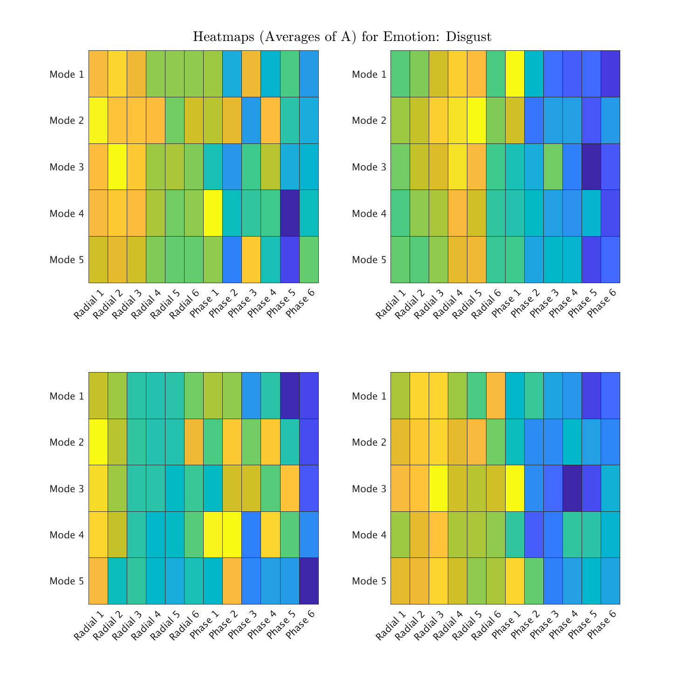
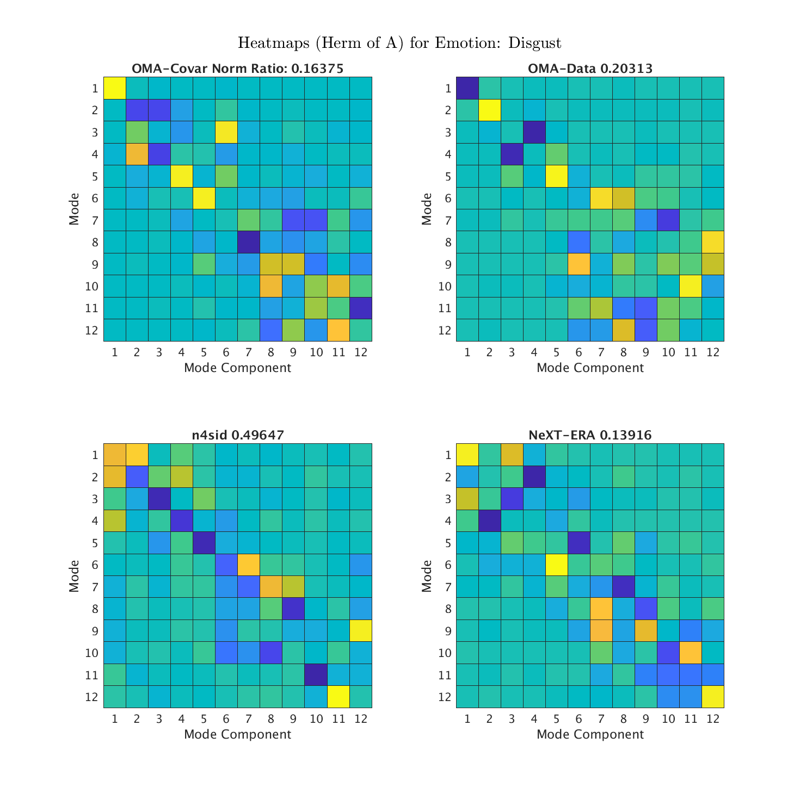
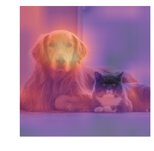
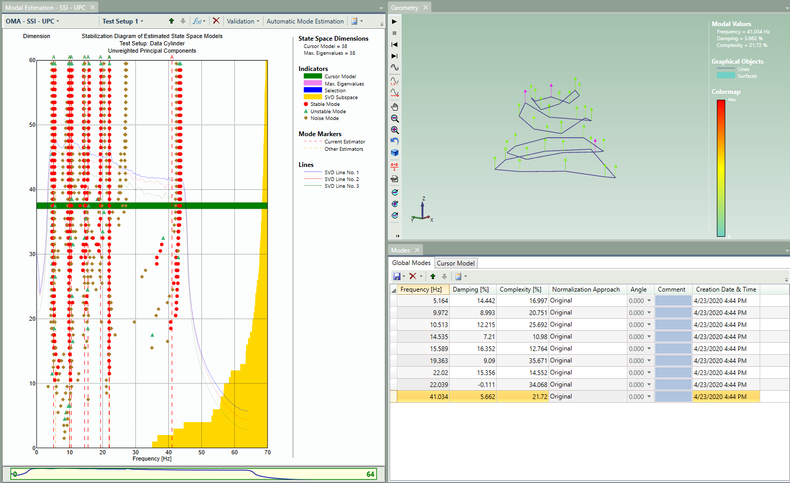

<!-- .slide: data-background="#500000" class="dark" -->

# Bi-Weekly Notes

## More on OMA and DEAP

2020-04-15

---

<!-- .slide: data-background="#767171" class="dark" -->

## Last Time:

- Looked at different output only state space algorithms
- How to get a single model for cognitive state?
    - Average the eigenvectors reconstruct A
    - Average A and determine the eigenvectors

 

---

<!-- .slide: data-background="#767171" class="dark" -->

## Average the Eigenvectors:
- Reconstruct the A matrix from averaged eigenvectors
- L.I. eigenvectors, but no guarantee of orthogonality or SA

---

<!-- .slide: data-background="#767171" class="dark" -->

## Average the A:
- Recalculate eigenvectors after averaging the A matrix
- L.I. eigenvectors, but again no guarantee of orthogonality or SA

---

<!-- .slide: data-background="#767171" class="dark" -->

## What if we force SA?:
- Recalculate eigenvectors after averaging the A matrix and forcing SA
- L.I., orthogonal eigenvectors for distinct eigenvalues
- Tricky C matrix

---

<!-- .slide: data-background="#767171" class="dark" -->

## What have we learned:
- OMA-data seems to be the most consistent across the data set
- If we postulate that pure emotions should be standing waves, SA transform is promising
    - Need to track the norm of the lost components somehow
    - But, need to understand why eigenvectors don't stay complex
        - SA does not restrict this
- It's too difficult for a human to look at these and learn anything

---

<!-- .slide: data-background="#767171" class="dark" -->

## Heatmaps for ML:
- A given complex mode:
    - $\phi_1=[1, -0.8, 0.4-0.3i, -1, 0.7+0.1i]$
- Represent complex mode as a heatmap:

  

---

<!-- .slide: data-background="#767171" class="dark" -->

## Look at All Eigenvectors:

- Both for hermitian and non-hermitian case
- Hermitian is non-complex, but more modes
- non-Hermitian is complex, but fewer modes

  
  

---

<!-- .slide: data-background="#767171" class="dark" -->

## Heatmaps for ML:
- Ask computer to distinguish images:

  

---

<!-- .slide: data-background="#767171" class="dark" -->

## Consider all channels:
- Early work with [Bruel & Kjaer](https://www.bksv.com/en/products/Analysis-software/structural-dynamics-software/modal-measurements-and-analysis/operational-modal-analysis-8760-8761-8762)
- Treat all channels as a flat plate, look for modes

  

---

<!-- .slide: data-background="#767171" class="dark" -->

## What have we learned 2.0:
- Loosing too much information in the self-adjoint transform
    - Need least squares
    - Need to be able to transform C matrix also
- ML heatmap analysis may suggest the best algorithm/representation
- Early work with all channels is promising. 

