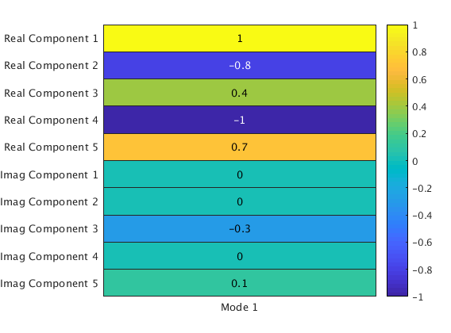

<!-- .slide: data-background="#500000" class="dark" -->

# Bi-Weekly Notes

## More on OMA and DEAP

2020-04-15

---

<!-- .slide: data-background="#767171" class="dark" -->

## Last Time:

- Looked at different output only state space algorithms
- How to get a single model for cognitive state?
    - Average the eigenvectors reconstruct A
    - Average A and determine the eigenvectors

 

---

<!-- .slide: data-background="#767171" class="dark" -->

## Average the Eigenvectors:
- Reconstruct the A matrix from averaged eigenvectors
- L.I. eigenvectors, but no guarantee of orthogonality or SA

---

<!-- .slide: data-background="#767171" class="dark" -->

## Average the A:
- Recalculate eigenvectors after averaging the A matrix
- L.I. eigenvectors, but again no guarantee of orthogonality or SA

---

<!-- .slide: data-background="#767171" class="dark" -->

## What if we force SA?:
- Recalculate eigenvectors after averaging the A matrix and forcing SA (least squares)
- L.I., orthogonal eigenvectors for distinct eigenvalues

---

<!-- .slide: data-background="#767171" class="dark" -->

## What have we learned:
- OMA-data seems to be the most consistent across the data set
- If we postulate that pure emotions should be standing waves, SA transform is promising
    - Need to track the norm of the lost components somehow
    - But, need to understand why eigenvectors don't stay complex
        - SA does not restrict this
- It's too difficult for a human to look at these and learn anything

---

<!-- .slide: data-background="#767171" class="dark" -->

## Next Steps:
- Heat map for ML
    - Exploratory analysis

- 

